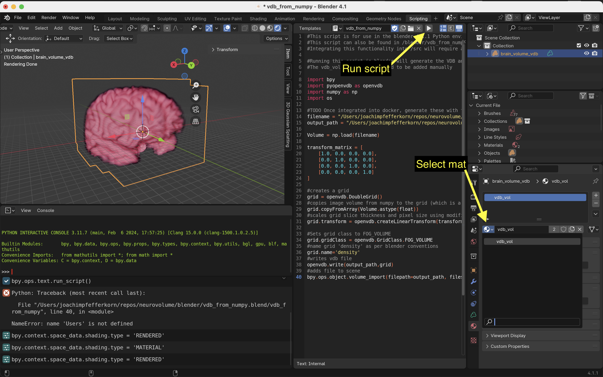

# Neurovolume (WIP)

Neurovolume is a VDB-based fMRI visualization and analysis pipeline. This project is currently a work in progress.


# Usage
The usage for Neurovolume is presently spread across a few different scripts. Once we remove dependencies and write our own, custom functions, we will be able to package this entire project within a single Blender plugin. We will also provide a library which can be adapted into other plugins and standalone tools.

It is possible to the `functions.py` library to pull some VDBs out of fMRI data. This, however, has not yet been implemented in the blender plugin.

## Basic Pipeline for Static MRIs
- This project uses poetry for dependency management. With poetry installed, you can build and enter the virtual environment with `poetry install`
- Run the `niigz2npy` script. This converts all compressed `nii.gz` `NIFTI` files to `.npy` files containing normalized numpy arrays. (Make sure your output folder is empty).

```shell
cd src/neurovolume
Python niigz2npy.py <path/to/output/folder/> <input/folder/one/> <input/folder/two> </etc.../>
```
- Open Blender and import the plugin found at `blender_plugin/__init__.py`
You can do this by copy and pasting the code into the blenders text editor and running it there.
- Once this is running, a GUI should appear on the right side of the 3D view. Paste the path to the folder containing your `.npy` files and click `Load .npy Files into Blender`
- This should load the VDB files into Blender for shading, animation, rendering, etc.


# Why VDB?
VDBs are a highly performant, art-directable, volumetric data structure that supports animations.  Unlike typical meshed based pipelines using the marching cubes algorithm, this volume based approach preserves the scan’s normalized density data throughout the VFX pipeline. The animation support will also be particularly useful when animating FMRI data as outlined in the roadmap below.

For more information on VDBs, see the [openVDB website](https://www.openvdb.org/)

# Blender, VDB, and Neuroscience Programming Environments
This project uses Poetry to manage dependencies and create a virtual environment. However, our Blender environment includes two dependencies -`pyopenvdb` and `bpy`- which are very hard to integrate into our current code base. Furthermore, our `ants`, our fMRI processing library, is very hard to use within blender.

Throughout the development, we have used a few different techniques to resolve these issues, including a [docker file](https://github.com/joachimbbp/openvdb_docker) specifically for OpenVDB.

Currently, we are using VSCode with [Jacques Lucke's Blender Extension](https://github.com/JacquesLucke/blender_vscode) to write our Blender plugin. This plugin holds all of the `bpy` and `pyopenvdb` code, while our `functions.py` and `niigz2npy.py` are written within the poetry environment. As we replace `ants` (and perhaps even `pyopenvdb`) with our own, dependency-minimal code, we will be able to write all of this within the same environment. This will hopefully create maximally portable code which can be easily adapted for many 3D softwares.

# Roadmap
Global Goal: write everything with dependencies available only within Blender's Python environment. Once this is achieved, we can easily package everything within a single Blender plugin and our separate library will be robust and portable.

Once achieved, the repo will contain the following:
- Stand-alone Blender Plugin containing all the functionality to convert `NIFTI` files into `VDB`.
- A minimal-dependency library containing fMRI processing tools for other projects (such as command-line tools or other VFX software plugins)
- A library for visualization (and possibly alignment) within Jupyter Notebooks (can include matplotlib dependencies, etc) 

## To Do
**Blender**
- [ ] Blender Plugin can directly import and process `NIFTI` files
    - Fully integrates `niigz2npy` and replaces `nibabel` functions with native `numpy`-only functions
    - Blender Plugin can implement method of subtraction for fMRI sequences
- [ ] VDB Grid Alignment and Combination in Blender


**fMRI**
- [x] Add fMRI Sequence import functionality in Blender Plugin
- [x] Method of Subtraction from Neutral Stimulus
    - Exists in the `bold_diffing` notebook. Currently this gives the user the most control, although we should integrate this into the Blender plugin when we implement the native `NIFTI` file parsing.
- [ ] Frame Interpolation Options for Realtime Playback
    - [x] Cross dissolve
    - [ ] Morph

**Dev**
- [ ] Clean up `poetry` dependencies
- [ ] Standardize Dimension Naming Conventions
    - `x y z t` vs `0 1 2 3` vs `Horizontal Coronal Sagittal Time`

# Dataset Citation
This software was tested using the following datasets.

Isaac David and Victor Olalde-Mathieu and Ana Y. Martínez and Lluviana Rodríguez-Vidal and Fernando A. Barrios (2021). Emotion Category and Face Perception Task Optimized for Multivariate Pattern Analysis. OpenNeuro. [Dataset] doi: 10.18112/openneuro.ds003548.v1.0.1

[OpenNeuro Link](https://openneuro.org/datasets/ds003548/versions/1.0.1)

The MNI Template can be found [Here](https://github.com/Angeluz-07/MRI-preprocessing-techniques/tree/main/assets/templates)