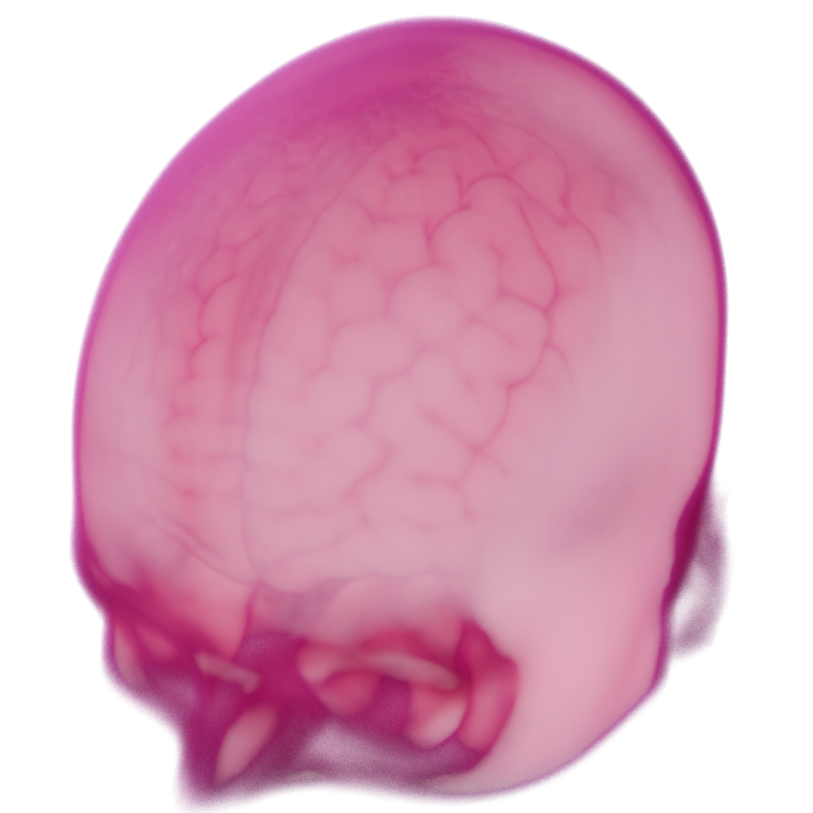
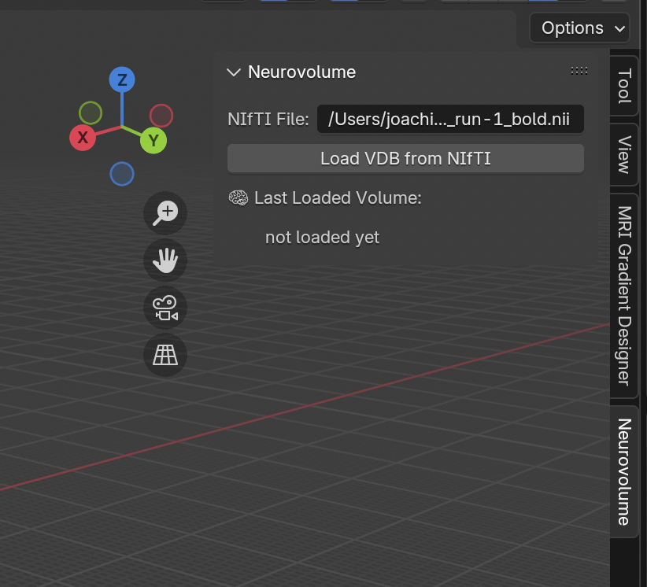
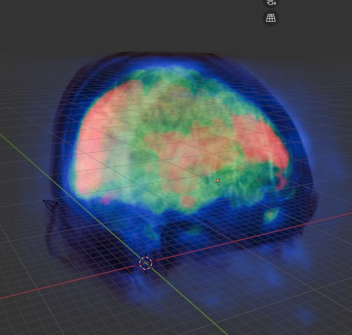

# Meta
## 🧠 ⚡️ ☁️
Neurovolume is a volumetric fMRI analysis pipeline and custom-built, scientific data-focused, VDB writer.

## 🐍 🦎 🧶
There is a high level library written in Python. The fast stuff under the hood, like NIfTI data parsing and the custom VDB writer, is written in Zig. The front-end runs in a Blender plugin but I hope to add plugins for more software.

## ⚠️ 🚧 🧪
This project is very much a **work in progress**. There is a lengthy road-map which I will be publishing in the future. As of now, I do not recommending regarding the images created by this software as scientifically accurate.

# ⚗️ Usage
## 💿 Installation and Requirements
Neurovolume requires [Zig 0.15.1](https://ziglang.org/download/#release-0.15.1). It was developed using [Blender 4.3.2](https://www.blender.org/download/releases/4-3/) and [Python 3.11.13](https://www.python.org/downloads/release/python-31113/), but these requirements might be a bit more flexible.

## 🏗️ Build
After installing Zig, Blender, and Python, run `zig build` from the project repo.

## ⚙️ Setup
The following files need to be modified before building and running. Presently the most robust way to run this program is to include the full system paths for all of these. Feel free to look at the example paths to get an idea of the setup.

In `./src/config.zig.zon`:
If you wish to run tests, download the [T1](https://s3.amazonaws.com/openneuro.org/ds003548/sub-01/anat/sub-01_T1w.nii.gz?versionId=5ZTXVLawdWoVNWe5XVuV6DfF2BnmxzQz) and [BOLD](https://s3.amazonaws.com/openneuro.org/ds003548/sub-01/func/sub-01_task-emotionalfaces_run-1_bold.nii.gz?versionId=tq8Y3ktm31Aa8JB0991n9K0XNmHyRS1Q) images to `./media`
Unzip both of these `.gz` files before running the tests.
- Set `.nifti_t1` and `.bold` to point to the above test files in media.
- Set `.vdb_output_dir` and `.output` to your output folder (defaults to `./output`).

In `./python/neurovolume.lib`:
- Set `lib_path` to the build file of the zig library (defaults to `./zig-out/lib/libneurovolume.dylib`)
- Set `output_dir` to your output directory (same as the `./output` path mentioned above in the `.zon` file)

In `./python/__init__.py` (the Blender plugin):
- Set `user_set_output_path` to the output path (same output as always)
- Set `user_set_default_nifti` to the `sub-01_T1w.nii` file in your media folder. This is optional, but it's sometimes nice to have a default path here when testing.

In `./python/testing.py` (Optional testing file):
- Set `static_testfile` to the `sub-01_T1w.nii` 

These hard-coded paths are not great and very much a hack. They were needed to cover some weird edge cases early in development and will be cleaned up later.

## 🔌 Running the Blender Plugin
Install the Blender plugin using one of the following methods:
- With [Jacques Lucke's vsCode extension for Blender](https://github.com/JacquesLucke/blender_vscode) (recommended)
- [Via the Add-ons section](https://docs.blender.org/manual/en/latest/editors/preferences/addons.html)
- Copy-pasting the add-on into Blender's [Text-editor](https://docs.blender.org/manual/en/latest/editors/text_editor.html) and then clicking the triangular "play" button to run.

Import a NIfTI files as a VDBs via the Neurovolume panel:
{ width=400px, height=350px }

Render and enjoy!

# Why VDB?
VDBs are a highly performant, art-directable, volumetric data structure that supports animations. Our volume-based approach aims to provide easy access to the original density data throughout the visualization and analysis pipeline.

For more information on VDBs, see the [openVDB website](https://www.openvdb.org/)

# 🛠️ Important Work in Progress
While a comprehensive road-map will be published soon, there are a few important considerations to take into account now.
- Neurovolume currently only supports `NIfTI1` files (and only some variants). Full coverage and `NIfTI2` will be supported soon.
- Presently the VDB writer isn't sparse. Tiles are in development.
- Frame interpolation (present in the original Go prototype) is currently under development on this branch. If you wish to access the old Go code, check out [the archive](https://github.com/joachimbbp/neurovolume_archive)

# 🧠 Dataset Citation
This software was tested using the following datasets.

Isaac David and Victor Olalde-Mathieu and Ana Y. Martínez and Lluviana Rodríguez-Vidal and Fernando A. Barrios (2021). Emotion Category and Face Perception Task Optimized for Multivariate Pattern Analysis. OpenNeuro. [Dataset] doi: 10.18112/openneuro.ds003548.v1.0.1

[OpenNeuro Study Link](https://openneuro.org/datasets/ds003548/versions/1.0.1)

[Direct Download Link for T1 Anat test file](https://s3.amazonaws.com/openneuro.org/ds003548/sub-01/anat/sub-01_T1w.nii.gz?versionId=5ZTXVLawdWoVNWe5XVuV6DfF2BnmxzQz)

[Direct Download Link for BOLD test file](https://s3.amazonaws.com/openneuro.org/ds003548/sub-01/func/sub-01_task-emotionalfaces_run-1_bold.nii.gz?versionId=tq8Y3ktm31Aa8JB0991n9K0XNmHyRS1Q)
 
The MNI Template can be found [Here](https://github.com/Angeluz-07/MRI-preprocessing-techniques/tree/main/assets/templates)
