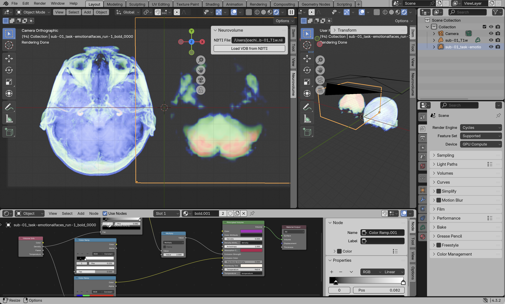

🧠 Neurovolume is a VDB-based fMRI visualization and analysis pipeline. This project is currently a work in progress.


# Installation and Usage
💾 **Software Requirements**
- Neurovolume is primarily written in Go, visit [go.dev](https://go.dev/doc/install) to download and install Go.
- Currently, the only front end is a Blender Plugin. For development we used `Version 4.3.2 (4.3.2 2024-12-17)`, which you can download [here](https://www.blender.org/download/releases/4-3/). It should work on most other versions as well.


🛠️ **Compiling Go Code**

- After cloning the github repo, navigate to `cmd` folder with `cd neurovolume/cmd/neurovolume`
- You can compile the code to an executable here with `go build main.go`

🌩️ **Creating a VDB from a NIfTI file**
- This executable can now be run from the command line with:
`./main /path/to/nifti/file.nii /path/to/output/folder`
    - (read on to see how you can run it through a Blender plugin)
- ⚠️ **Warning:** This project has only been tested for NIfTI-1 files. NIfTI-2 files are not yet supported.

🔌 **Setting Up the Blender Add-On**
- After compiling the Go code, open the Blender plugin located at `neurovolume/blender_plugin/__init__.py`
- Edit the following lines to match the paths on your machine:
```python
# Where you will save the VDB and metadata:
user_set_output_path = "/Users/username/repos/neurovolume/output"
# Path to your Go executable:
user_set_exe_path = "/Users/username/repos/neurovolume/cmd/neurovolume/main"
# Optional, the default path that appears when you first open the panel:
user_set_default_nifti = "/Users/username/repos/neurovolume/media/sub-01_T1w.nii" 
```
- Install the Blender plugin using one of the following methods::
    - With [Jacques Lucke's vsCode extension for Blender](https://github.com/JacquesLucke/blender_vscode) (recommended)
    - [Via the Add-ons section](https://docs.blender.org/manual/en/latest/editors/preferences/addons.html)
    - Copy-pasting the add-on into Blender's [Text-editor](https://docs.blender.org/manual/en/latest/editors/text_editor.html) and then clicking the triangular "play" button to run.

**Running The Blender Plugin**
- From the Neurovolume panel, enter the path to your NIfTI file and click `Load VDB from NIfTI`
- 🕰️ **Please Note**, this might take a few seconds to a few minutes. The program is not responsive at this point yet. If you would like to check progress I recommend running Blender from the terminal to see the print statements roll by.
- Enjoy!



# Why VDB?

VDBs are a highly performant, art-directable, volumetric data structure that supports animations. Unlike typical meshed-based pipelines using the marching cubes algorithm, our volume-based approach will preserve the scan’s normalized density data throughout the visualization pipeline. The animation support is particularly useful for animating BOLD response.

For more information on VDBs, see the [openVDB website](https://www.openvdb.org/)


# To-Do
**Blender**
- [x] Blender Plugin can directly import and process `NIFTI` files
    - [ ] Blender Plugin can implement method of subtraction for fMRI sequences
- [ ] VDB Grid Alignment and Combination in Blender
- [ ] GUI Loading animations

**fMRI**
- [x] Add fMRI Sequence import functionality in Blender Plugin
- [x] Method of Subtraction from Neutral Stimulus
    - Exists in the `bold_diffing` notebook. Currently this gives the user the most control, although we should integrate this into the Blender plugin when we implement the native `NIFTI` file parsing.
- [ ] Frame Interpolation Options for Realtime Playback (re implement in the Go-Backend)
    - [ ] Cross dissolve
    - [ ] Morph

**Dev**
- [ ] Increase performance in native VDB writer (try to match PyOpenVDB)
- [x] Add support for `gz` files
- [ ] Add support for `NIfTI-2` files
- [ ] Unit Testing


# Dataset Citation
This software was tested using the following datasets.

Isaac David and Victor Olalde-Mathieu and Ana Y. Martínez and Lluviana Rodríguez-Vidal and Fernando A. Barrios (2021). Emotion Category and Face Perception Task Optimized for Multivariate Pattern Analysis. OpenNeuro. [Dataset] doi: 10.18112/openneuro.ds003548.v1.0.1

[OpenNeuro Link](https://openneuro.org/datasets/ds003548/versions/1.0.1)

The MNI Template can be found [Here](https://github.com/Angeluz-07/MRI-preprocessing-techniques/tree/main/assets/templates)