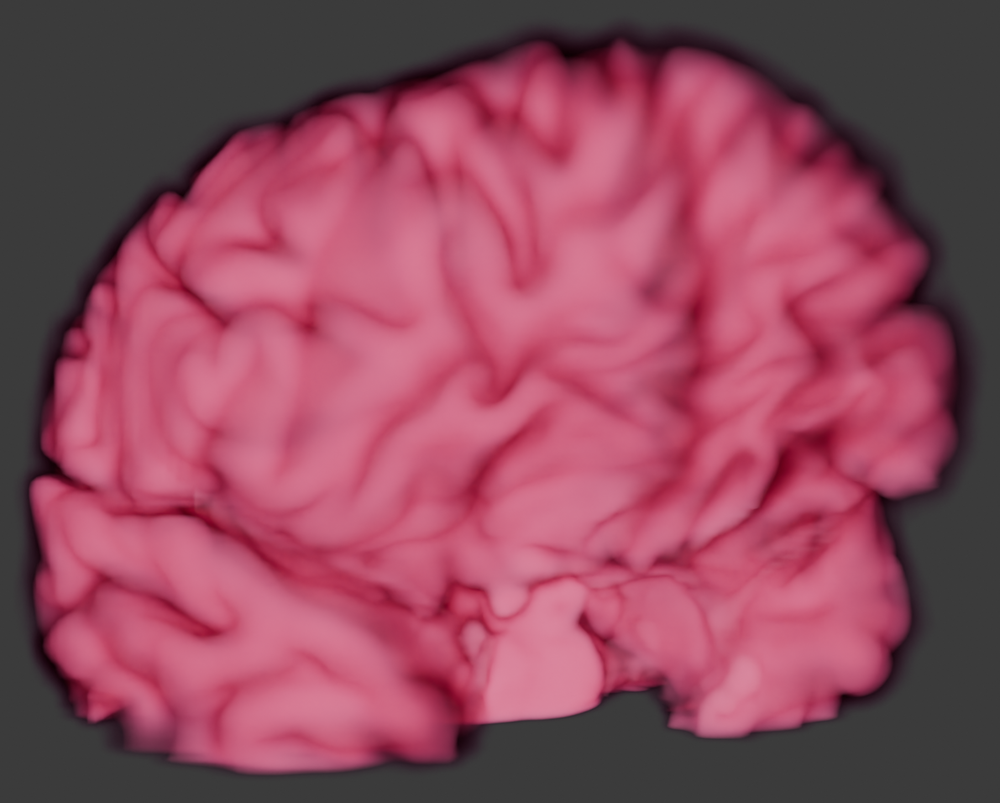

# Neuro Volume
A VDB representation of neurological MRI data.

# Usage
- Generate a NumPy array suitable for conversion to a VDB, run the cells in `src/neuro_volume/generate_neuro_volume.ipynb`
- Convert the VDB and load it into blender as a volume by running the `vdb_from_numpy.py` script in the Blender file found here: `blender/vdb_from_numpy.blend`
    - Note this script can also be found in the `src` folder, but will only run in the Blender environment
- The material must be selected by hand after loading the VDB

# Why VDB?
VDBs are a highly performant, art-directable, volumetric data structure that supports animations. Unlike typical meshed based pipelines using the marching cubes algorithm, this volume based approach preserves the scan’s normalized density data throughout the VFX pipeline. The animation support will also be particularly useful when animating FMRI data as outlined in the roadmap below.

For more information on VDBs, see the [openVDB website](https://www.openvdb.org/)

# Roadmap
- [ ] Automated slice height spacing based on scan metadata
- [ ] Docker Container to integrate OpenVDB into `src/neuro_volume`
- [ ] Automated Blender opening and texturing
- [ ] Animated FMRI usage
- [ ] Slice-level rotoscope-based anatomy masking
- [ ] Improve Blender VDB texturing

# Contact
jbbpfefferkorn@gmail.com

# Citations
The MRI data used in this prototype is from openneuro.org

Philippe Poulin and Guillaume Theaud and Pierre-Marc Jodoin and Maxime Descoteaux (2022). TractoInferno: A large-scale, open-source, multi-site database for machine learning dMRI tractography. OpenNeuro. [Dataset] doi: doi:10.18112/openneuro.ds003900.v1.1.1