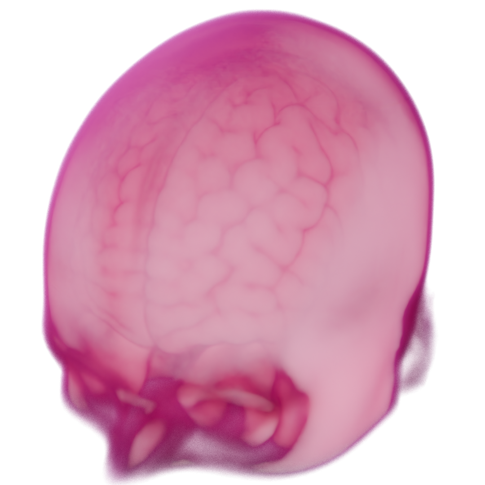

Neurovolume is a Python library for manipulating and visualizing volumetric data. It includes a custom-built, scientific data-focused, VDB writer. The VDB writer is written in Zig with no external dependencies.

While this project focuses on neuroscience, it includes `ndarray` to `VDB` to support virtually any volumetric data pipeline.

This project is under active development and might not have everything you need. Please reference reference our [roadmap](ROADMAP.md) to see what is in the works!

This project is available as a pre-release alpha on [pypi](https://pypi.org/project/neurovolume/). Presently it is only available for arm64. More operating systems coming soon!

# 🏗️ Building
If you are building locally, we use uv to build and test the project:
```bash
uv run python -m ziglang build && uv run pytest tests -s
```
#

This is how you might overlay a BOLD sequence onto an anatomical scan:

````python
# acquire arrays and fps from the nibable image (see test_integration.py)

bold_diff = nv.Channel(
    "bold",
    sub(nv.prep_ndarray(bold_arr)),
    transform=bold_affine,
    source_fps=fps,
    playback_fps=24,
    speed=1,
    interpolation=nv.modes.Interpolation.direct,
)
t1 = nv.Channel(
    "t1",
    nv.prep_ndarray(t1_arr),
    transform=t1_affine,
    num_source_frames=bold_diff.num_output_frames,
    interpolation=nv.modes.Interpolation.frozen,
    prune=np.float32(0.1),
)

save_config = nv.SaveConfig("fmri_bold_sub_fade", folder=vdb_out / "fmri_seq")
fmri = nv.Sequence([bold_diff, t1], save_config)
fmri.write()
````

See `tests/test_integration.py` for 

Higher sparsity amounts will result in better performance and lower disk space usage. However, after a certain point, they begin to degrade the VDB quality.

# 📀 Projects
- [BoldViz](https://github.com/joachimbbp/boldviz): a Blender plugin for fMRI and MRI visualizations. It was used to create the renders in this README. A great place to start if you don't want to deal with writing any Python.
- [Neurovolume Examples](https://github.com/joachimbbp/neurovolume_examples) and [Physarum](https://github.com/joachimbbp/physarum) include some good starting points for how one might use this library with numpy.
- The [nibabel example](https://github.com/joachimbbp/neurovolume_examples/blob/master/nibabel_example.py) shows how to use an external NIfTI parser, which could be of use for not-yet-supported filetypes. We're moving away from native file parsing as everyone seems to use numpy, but please reach out if this is something that you'd want!

# ☁️ Why VDB?
VDBs are a highly performant, art-directable, sparse volumetric data structure. Our volume-based approach aims to provide easy access to the original density data throughout the visualization and analysis pipeline. Unlike the [openVDB repo](https://www.openvdb.org/), our smaller version is much more readable and does not need to be run in a docker container.

# 🧠 Dataset Citation
This software was tested using the following datasets.

Isaac David and Victor Olalde-Mathieu and Ana Y. Martínez and Lluviana Rodríguez-Vidal and Fernando A. Barrios (2021). Emotion Category and Face Perception Task Optimized for Multivariate Pattern Analysis. OpenNeuro. [Dataset] doi: 10.18112/openneuro.ds003548.v1.0.1

[OpenNeuro Study Link](https://openneuro.org/datasets/ds003548/versions/1.0.1)

[Direct Download Link for T1 Anat test file](https://s3.amazonaws.com/openneuro.org/ds003548/sub-01/anat/sub-01_T1w.nii.gz?versionId=5ZTXVLawdWoVNWe5XVuV6DfF2BnmxzQz)

[Direct Download Link for BOLD test file](https://s3.amazonaws.com/openneuro.org/ds003548/sub-01/func/sub-01_task-emotionalfaces_run-1_bold.nii.gz?versionId=tq8Y3ktm31Aa8JB0991n9K0XNmHyRS1Q)
 
The MNI Template can be found [Here](https://github.com/Angeluz-07/MRI-preprocessing-techniques/tree/main/assets/templates)
